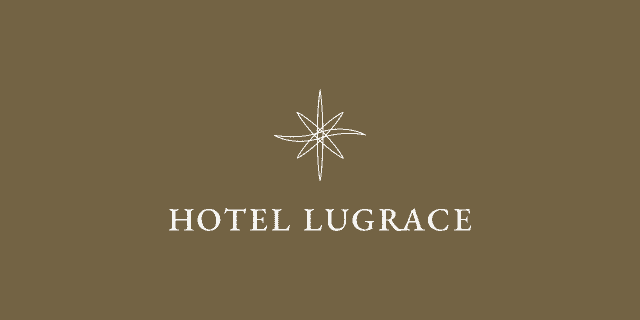

# HOTEL LUGRACE - Official Website

「あのとき、あの一瞬を、至高のひとときに。」をコンセプトとした、  
架空のラグジュアリーホテル「HOTEL LUGRACE」のコンセプトサイトです。

---

## 1. サイト概要

### 名称について
「LUGRACE」という名称は、**Luxury（贅沢）** + **Grace（優雅な）** + **Grade（等級）** + **Place（空間）** を組み合わせた造語です。  
贅沢かつ優雅な等級の空間を提供するホテルという思いを込めネーミングしました。

### ロゴデザイン

時計の針をモチーフにデザインしています。  
水平な針が波打つ形状は、「至高のひととき」を表現しています。  
針が指す8つの方向は、日本の「末広がり」の縁起の良さと、  
東西南北あらゆる場所から訪れるお客様に対し、至高のおもてなしを提供することを意味しています。

### サイトデザイン・演出
- **カラー:** 高級感と落ち着きを兼ね備えたブラウンをキーカラーに採用。
- **アニメーション:** GSAPを用いたフェードインやパララックスを実装。Lenisによる慣性スクロールを導入し、デュレーションを長めに設定することで、操作感からも「優雅さ・上品さ」を感じられる演出にこだわりました。

---

## 2. 技術スタック / クレジット

当サイトの制作にあたり、下記のライブラリ・ツールを使用しています。

- **アニメーション:** [GSAP](https://greensock.com/gsap/) / [Lenis](https://github.com/darkroomengineering/lenis)
- **AI:** 画像生成・テキスト校正：ChatGPT (DALL-E 3) / Gemini

---

## 3. ライセンス

### ソースコードおよびコンテンツの取り扱い
当リポジトリは、GitHub Pages での公開を主目的としており、**ソースコードの共有・再利用を目的としたものではありません。**

- **独自ソースコード・デザイン・画像等:** 許可なく複製、改変、配布、または自身のプロジェクトへの流用を行うことを固く禁じます。
- **外部ライブラリ:** 「GSAP」および「Lenis」の著作権は、それぞれの権利者に帰属し、各ライブラリのライセンスに準拠します。

### 免責事項
「HOTEL LUGRACE」は架空の名称であり、実在するあらゆる企業・団体・個人とは一切関係ございません。

---

## 4. フィードバックのお願い

デザインやコーディング面で、ご意見・ご助言をいただける方は、ディスカッションタブでご共有ください。

**Copyright &copy; 2026 たき (TAKI) All Rights Reserved.**